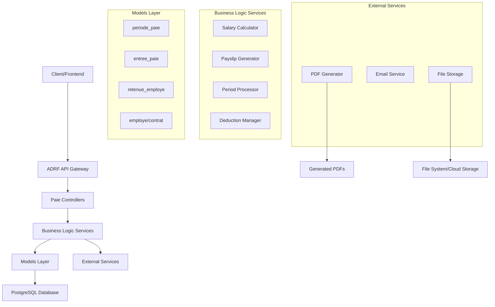

# Design Document: Système de Paie

## Overview

Ce document décrit la conception d'un système de gestion de paie complet utilisant Django avec ADRF (Async Django REST Framework). Le système permettra de calculer automatiquement les salaires, gérer les retenues, générer des bulletins de paie et assurer le suivi des périodes de paie avec des performances optimisées grâce aux opérations asynchrones.

## Architecture

Le système suit une architecture modulaire Django avec les composants suivants :



## Components and Interfaces

### 1. Models (Existing + Extensions)

#### periode_paie (Enhanced)
```python
class periode_paie(Base_model):
    annee = models.IntegerField()
    mois = models.IntegerField()
    date_debut = models.DateField()
    date_fin = models.DateField()
    statut = models.CharField(max_length=20, choices=STATUT_CHOICES)
    trait
cimalField(max_digits=15, decimal_places=2, default=0)
```

#### entree_paie (Enhanced)
```python
class entree_paie(Base_model):
    employe_id = models.ForeignKey(employe, on_delete=models.CASCADE)
    periode_paie_id = models.ForeignKey(periode_paie, on_delete=models.CASCADE)
    contrat_reference = models.JSONField()  # Snapshot du contrat au moment du calcul

    # Composants du salaire
    salaire_base = models.DecimalField(max_digits=12, decimal_places=2)
    indemnite_logement = models.DecimalField(max_digits=12, decimal_places=2, default=0)
    indemnite_deplacement = models.DecimalField(max_digits=12, decimal_places=2, default=0)
    indemnite_fonction = models.DecimalField(max_digits=12, decimal_places=2, default=0)
    allocation_familiale = models.DecimalField(max_digits=12, decimal_places=2, default=0)
    autres_avantages = models.DecimalField(max_digits=12, decimal_places=2, default=0)
    salaire_brut = models.DecimalField(max_digits=12, decimal_places=2)

    # Cotisations et retenues
    cotisations_patronales = models.JSONField(default=dict)
    cotisations_salariales = models.JSONField(default=dict)
    retenues_diverses = models.JSONField(default=dict)

    # Totaux
    total_charge_salariale = models.DecimalField(max_digits=12, decimal_places=2)
    base_imposable = models.DecimalField(max_digits=12, decimal_places=2)
    salaire_net = models.DecimalField(max_digits=12, decimal_places=2)

    # Bulletin de paie
    payslip_generated = models.BooleanField(default=False)
    payslip_file = models.FileField(upload_to='payslips/', blank=True, null=True)
    payslip_generated_at = models.DateTimeField(null=True, blank=True)

    # Validation et statut
    is_validated = models.BooleanField(default=False)
    validation_errors = models.JSONField(default=list)
```

#### retenue_employe (Enhanced)
```python
class retenue_employe(Base_model):
    employe_id = models.ForeignKey(employe, on_delete=models.CASCADE)
    type_retenue = models.CharField(max_length=20, choices=TYPES_RETENUE)
    description = models.CharField(max_length=500)
    montant_mensuel = models.DecimalField(max_digits=12, decimal_places=2)
    montant_total = models.DecimalField(max_digits=12, decimal_places=2, null=True, blank=True)
    montant_deja_deduit = models.DecimalField(max_digits=12, decimal_places=2, default=0)
    date_debut = models.DateField()
    date_fin = models.DateField(null=True, blank=True)
    est_active = models.BooleanField(default=True)
    est_recurrente = models.BooleanField(default=True)
    cree_par = models.ForeignKey(User, on_delete=models.SET_NULL, null=True)

    # Informations bancaires pour remboursements
    banque_beneficiaire = models.CharField(max_length=255, blank=True)
    compte_beneficiaire = models.CharField(max_length=255, blank=True)
```

### 2. Business Logic Services

#### SalaryCalculatorService
```python
class SalaryCalculatorService:
    async def calculate_salary(self, employe_id: int, periode_id: int) -> Dict
    async def calculate_gross_salary(self, contrat: contrat, periode: periode_paie) -> Decimal
    async def calculate_family_allowance(self, nombre_enfants: int) -> Decimal
    async def calculate_social_contributions(self, gross_salary: Decimal, contrat: contrat) -> Dict
    async def calculate_income_tax(self, taxable_base: Decimal) -> Decimal
    async def calculate_deductions(self, employe_id: int, periode_id: int) -> Dict
    async def calculate_net_salary(self, components: Dict) -> Decimal
```

#### PayslipGeneratorService
```python
class PayslipGeneratorService:
    async def generate_payslip(self, entree_paie_id: int) -> str
    async def generate_batch_payslips(self, periode_id: int) -> List[str]
    async def get_payslip_template(self) -> str
    async def render_payslip_pdf(self, context: Dict) -> bytes
    async def save_payslip_file(self, pdf_content: bytes, filename: str) -> str
```

#### PeriodProcessorService
```python
class PeriodProcessorService:
    async def create_period(self, annee: int, mois: int, user_id: int) -> periode_paie
    async def process_period(self, periode_id: int) -> Dict
    async def validate_period(self, periode_id: int) -> List[str]
    async def finalize_period(self, periode_id: int) -> bool
    async def approve_period(self, periode_id: int, user_id: int) -> bool
    async def calculate_period_totals(self, periode_id: int) -> Dict
```

#### DeductionManagerService
```python
class DeductionManagerService:
    async def create_deduction(self, data: Dict) -> retenue_employe
    async def get_active_deductions(self, employe_id: int, periode: periode_paie) -> List[retenue_employe]
    async def apply_deduction(self, retenue: retenue_employe, periode: periode_paie) -> Decimal
    async def update_deduction_balance(self, retenue_id: int, montant_deduit: Decimal) -> None
    async def deactivate_completed_deductions(self, employe_id: int) -> None
```

### 3. API Controllers (ADRF Views)

#### PeriodePaieAPIView
```python
class PeriodePaieAPIView(AsyncModelViewSet):
    async def create(self, request) -> Response  # Créer nouvelle période
    async def list(self, request) -> Response    # Lister périodes avec filtres
    async def retrieve(self, request, pk) -> Response  # Détail période
    async def process(self, request, pk) -> Response   # Traiter période
    async def finalize(self, request, pk) -> Response  # Finaliser période
    async def approve(self, request, pk) -> Response   # Approuver période
    async def export(self, request, pk) -> Response    # Export Excel
```

#### EntreePaieAPIView
```python
class EntreePaieAPIView(AsyncModelViewSet):
    async def list(self, request) -> Response      # Lister entrées avec filtres
    async def retrieve(self, request, pk) -> Response  # Détail entrée
    async def recalculate(self, request, pk) -> Response  # Recalculer entrée
    async def generate_payslip(self, request, pk) -> Response  # Générer bulletin
    async def download_payslip(self, request, pk) -> Response  # Télécharger PDF
```

#### RetenueEmployeAPIView
```python
class RetenueEmployeAPIView(AsyncModelViewSet):
    async def create(self, request) -> Response    # Créer retenue
    async def list(self, request) -> Response      # Lister retenues
    async def update(self, request, pk) -> Response    # Modifier retenue
    async def deactivate(self, request, pk) -> Response  # Désactiver retenue
    async def history(self, request, pk) -> Response     # Historique retenue
```

### 4. Serializers (ADRF-flex-fields)

#### PeriodePaieSerializer
```python
class PeriodePaieSerializer(FlexFieldsModelSerializer):
    class Meta:
        model = periode_paie
        fields = '__all__'
        expandable_fields = {
            'entries': ('paie_app.serializers.EntreePaieSerializer', {'many': True}),
            'traite_par': ('user_app.serializers.UserSerializer', {}),
        }
```

#### EntreePaieSerializer
```python
class EntreePaieSerializer(FlexFieldsModelSerializer):
    salary_breakdown = serializers.SerializerMethodField()

    class Meta:
        model = entree_paie
        fields = '__all__'
        expandable_fields = {
            'employe_id': ('user_app.serializers.EmployeSerializer', {}),
            'periode_paie_id': ('paie_app.serializers.PeriodePaieSerializer', {}),
        }

    def get_salary_breakdown(self, obj):
        return {
            'gross_components': {...},
            'deductions': {...},
            'contributions': {...},
            'net_salary': obj.salaire_net
        }
```

## Data Models

### Salary Calculation Flow
```python
{
    "input": {
        "employe_id": "ID de l'employé",
        "periode_id": "ID de la période",
        "contrat": "Données contractuelles"
    },
    "calculation_steps": [
        "1. Calcul salaire brut (base + indemnités + allocations)",
        "2. Calcul cotisations patronales (INSS, MFP, FPC)",
        "3. Calcul cotisations salariales (INSS, MFP, FPC)",
        "4. Calcul base imposable",
        "5. Calcul IRE",
        "6. Application retenues diverses",
        "7. Calcul salaire net"
    ],
    "output": {
        "salaire_brut": "Decimal",
        "cotisations_patronales": "Dict",
        "cotisations_salariales": "Dict",
        "base_imposable": "Decimal",
        "ire": "Decimal",
        "retenues": "Dict",
        "salaire_net": "Decimal"
    }
}
```

### Payslip Data Structure
```python
{
    "employee_info": {
        "nom_complet": "Nom complet employé",
        "matricule": "Matricule",
        "poste": "Intitulé du poste",
        "date_embauche": "Date d'embauche"
    },
    "period_info": {
        "periode": "MM/YYYY",
        "date_debut": "Date début période",
        "date_fin": "Date fin période"
    },
    "salary_components": {
        "salaire_base": "Decimal",
        "indemnites": {...},
        "allocations": {...},
        "autres_avantages": "Decimal"
    },
    "deductions": {
        "cotisations_salariales": {...},
        "ire": "Decimal",
        "retenues_diverses": {...}
    },
    "employer_contributions": {
        "cotisations_patronales": {...}
    },
    "totals": {
        "salaire_brut": "Decimal",
        "total_deductions": "Decimal",
        "salaire_net": "Decimal"
    }
}
```

## Correctness Properties

*A property is a characteristic or behavior that should hold true across all valid executions of a system-essentially, a formal statement about what the system should do. Properties serve as the bridge between human-readable specifications and machine-verifiable correctness guarantees.*

### Property 1: Period Creation Consistency
*For any* new payroll period creation, the system should create a period with the specified year, month, and default status "DRAFT".
**Validates: Requirements 1.1**

### Property 2: Period Uniqueness Enforcement
*For any* year and month combination, only one payroll period should exist in the system.
**Validates: Requirements 1.2**

### Property 3: Period Status Transitions
*For any* period finalization, the system should change status to "COMPLETED" and record the processing timestamp.
**Validates: Requirements 1.3**

### Property 4: Period Approval Immutability
*For any* approved period, the system should prevent any further modifications to the period data.
**Validates: Requirements 1.4**

### Property 5: Automatic Period Date Calculation
*For any* period with year and month, the system should automatically calculate correct start and end dates.
**Validates: Requirements 1.5**

### Property 6: Base Salary Usage
*For any* salary calculation, the system should use the base salary from the employee's active contract.
**Validates: Requirements 2.1**

### Property 7: Allowance Percentage Application
*For any* salary calculation, allowances should be calculated using the percentages defined in the employee's contract.
**Validates: Requirements 2.2**

### Property 8: Family Allowance Progressive Scale
*For any* employee, family allowance should follow the progressive scale based on number of children.
**Validates: Requirements 2.3**

### Property 9: INSS Contribution Caps
*For any* salary calculation, INSS contributions should respect regulatory caps (pension: 6% max 27000, risk: 6% max 2400).
**Validates: Requirements 2.4**

### Property 10: IRE Progressive Tax Calculation
*For any* taxable income, IRE should be calculated using the progressive tax brackets (0%, 20%, 30%).
**Validates: Requirements 2.5**

### Property 11: Net Salary Formula Correctness
*For any* salary calculation, the net salary should equal gross salary minus all employee contributions, taxes, and deductions.
**Validates: Requirements 2.6**

### Property 12: Deduction Creation Completeness
*For any* deduction creation, the system should record all required fields (type, amount, dates, bank information).
**Validates: Requirements 3.1**

### Property 13: Recurring Deduction Application
*For any* recurring deduction, the system should apply it automatically each month until the end date.
**Validates: Requirements 3.2**

### Property 14: Deduction Total Amount Limit
*For any* deduction with a defined total amount, the system should stop deductions once the total is reached.
**Validates: Requirements 3.3**

### Property 15: Active Deductions Inclusion
*For any* salary calculation, the system should include all active deductions for the period.
**Validates: Requirements 3.4**

### Property 16: Payslip Information Completeness
*For any* generated payslip, it should contain all required employee and company information.
**Validates: Requirements 4.1**

### Property 17: Payslip Salary Component Details
*For any* generated payslip, it should detail all gross salary components.
**Validates: Requirements 4.2**

### Property 18: Payslip Contribution Details
*For any* generated payslip, it should detail all employer and employee contributions.
**Validates: Requirements 4.3**

### Property 19: Payslip Deduction Details
*For any* generated payslip, it should detail all applied deductions.
**Validates: Requirements 4.4**

### Property 20: Payslip Net Salary Display
*For any* generated payslip, it should calculate and display the correct net salary.
**Validates: Requirements 4.5**

### Property 21: Payslip File Storage
*For any* generated payslip PDF, the system should store the file for future consultation.
**Validates: Requirements 4.7**

### Property 22: Batch Processing Coverage
*For any* period processing, the system should calculate salaries for all employees with active contracts.
**Validates: Requirements 5.1**

### Property 23: Payroll Entry Creation
*For any* period processing, the system should create a payroll entry for each eligible employee.
**Validates: Requirements 5.2**

### Property 24: Contract Data Consistency
*For any* period processing, the system should use contract data valid at the processing date.
**Validates: Requirements 5.3**

### Property 25: Processing Atomicity
*For any* period processing failure, the system should rollback all operations for that period.
**Validates: Requirements 5.4**

### Property 26: Period Reprocessing Capability
*For any* period, the system should allow reprocessing by overwriting previous calculations.
**Validates: Requirements 5.5**

### Property 27: Contract Validation Before Calculation
*For any* salary calculation, the system should verify the employee has an active contract for the period.
**Validates: Requirements 7.1**

### Property 28: Deduction Validity Verification
*For any* deduction application, the system should verify the deduction is active and within its validity period.
**Validates: Requirements 7.2**

### Property 29: Regulatory Compliance Verification
*For any* contribution calculation, the system should apply correct regulatory caps and rates.
**Validates: Requirements 7.3**

### Property 30: Error Alert Generation
*For any* detected inconsistency, the system should generate an alert with error details.
**Validates: Requirements 7.4**

### Property 31: Error Prevention Before Finalization
*For any* period with calculation errors, the system should prevent finalization.
**Validates: Requirements 7.5**

### Property 32: Operation Audit Logging
*For any* payroll operation, the system should record who performed the operation and when.
**Validates: Requirements 8.1**

### Property 33: Payslip Generation Audit
*For any* payslip generation, the system should record the generation date and user.
**Validates: Requirements 8.2**

### Property 34: Deduction Modification History
*For any* deduction modification, the system should preserve the modification history.
**Validates: Requirements 8.3**

### Property 35: API Availability for Consultation
*For any* consultation operation, the system should provide corresponding REST API endpoints.
**Validates: Requirements 9.1**

### Property 36: API Availability for Processing
*For any* period processing operation, the system should provide corresponding REST API endpoints.
**Validates: Requirements 9.2**

### Property 37: API Availability for Payslip Generation
*For any* payslip generation operation, the system should provide corresponding REST API endpoints.
**Validates: Requirements 9.3**

### Property 38: API Security with JWT
*For any* API access, the system should require valid JWT authentication.
**Validates: Requirements 9.4**

### Property 39: Asynchronous Batch Processing
*For any* bulk payslip generation, the system should use asynchronous processing.
**Validates: Requirements 10.2**

### Property 40: Parallel Processing Capability
*For any* salary calculations, the system should support parallel processing when beneficial.
**Validates: Requirements 10.5**

## Error Handling

### Calculation Errors
- **Missing Contract**: Si un employé n'a pas de contrat actif, le système doit ignorer l'employé et logger l'erreur
- **Invalid Data**: Les données contractuelles invalides doivent être signalées avec détails spécifiques
- **Calculation Overflow**: Les calculs dépassant les limites numériques doivent être gérés gracieusement

### Period Processing Errors
- **Concurrent Processing**: Empêcher le traitement simultané de la même période par plusieurs utilisateurs
- **Incomplete Data**: Valider que tous les employés actifs ont les données nécessaires avant traitement
- **System Failures**: Implémenter des mécanismes de rollback en cas d'échec partiel

### File Generation Errors
- **PDF Generation Failure**: Retry automatique avec fallback vers génération simplifiée
- **Storage Errors**: Gestion des erreurs de stockage avec notification à l'administrateur
- **Template Errors**: Validation des templates avec messages d'erreur détaillés

## Testing Strategy

### Dual Testing Approach
Le système utilisera une approche de test double combinant :

**Unit Tests** :
- Tests spécifiques pour chaque composant de calcul salarial
- Validation des cas limites (salaires minimum/maximum, plafonds)
- Tests d'intégration entre services
- Vérification des formats de réponse API

**Property-Based Tests** :
- Validation des propriétés universelles sur de nombreux scénarios générés
- Tests de cohérence des calculs avec données aléatoires
- Vérification de la robustesse du système
- Configuration minimale de 100 itérations par test de propriété

### Property Test Configuration
- **Framework**: Utilisation de `hypothesis` pour Python
- **Iterations**: Minimum 100 itérations par test de propriété
- **Tagging**: Chaque test de propriété sera tagué avec le format :
  **Feature: paie-system, Property {number}: {property_text}**
- **Coverage**: Chaque propriété de correction doit être implémentée par UN SEUL test de propriété

### Test Data Generation
- **Employees**: Génération d'employés avec différents profils contractuels
- **Salaries**: Génération de salaires dans différentes tranches
- **Deductions**: Génération de retenues de différents types et montants
- **Periods**: Génération de périodes avec différents statuts
- **Edge Cases**: Tests spécifiques pour les cas limites réglementaires
