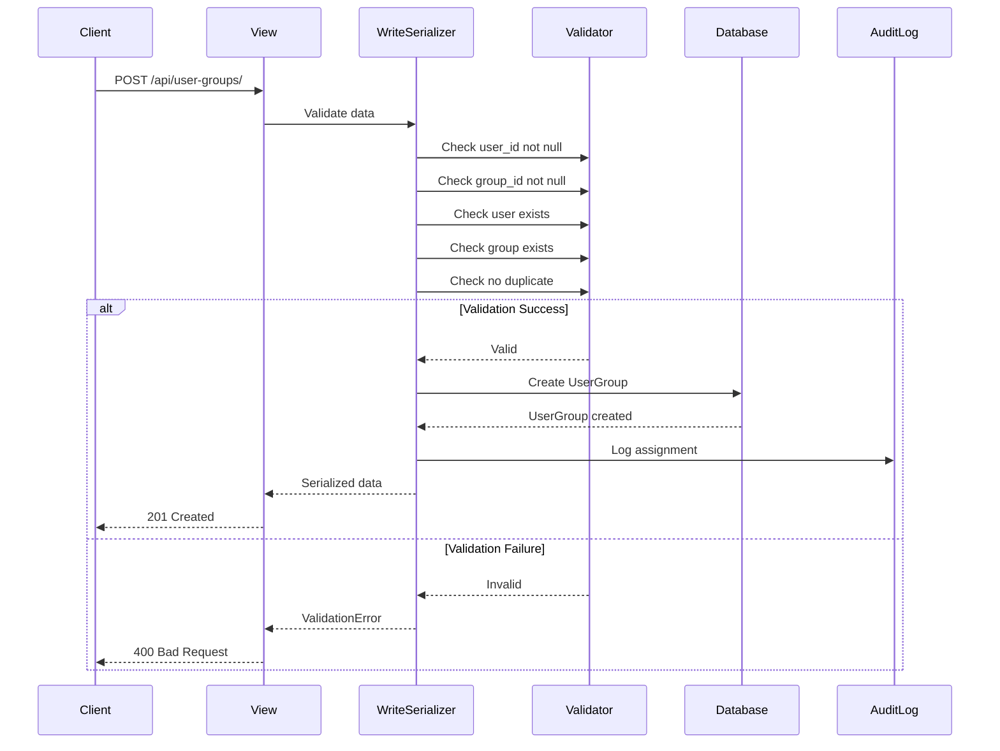
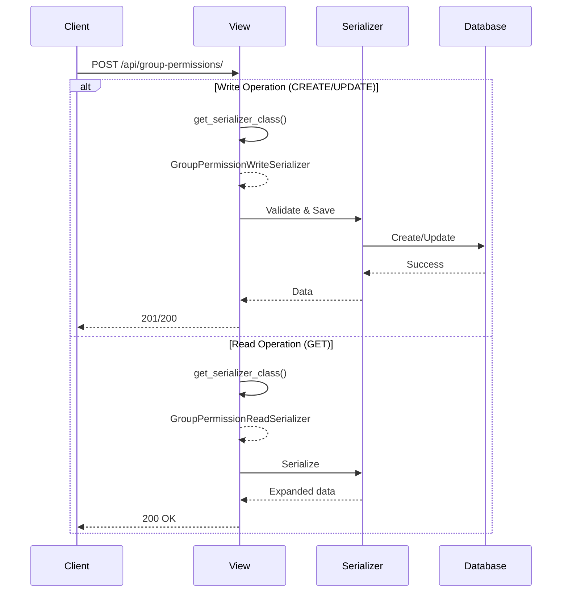

# Design Document: Test Fixes and System Validation

## Overview

Ce document présente la conception des corrections nécessaires pour résoudre les 13 tests échoués dans le système de gestion des utilisateurs. Les corrections sont organisées par catégorie de problème et incluent des exemples de code avant/après pour chaque fix.

## Architecture des Corrections

### Vue d'ensemble des problèmes

```mermaid
graph TB
    A[13 Tests Échoués] --> B[Problèmes Serializer]
    A --> C[Problèmes Configuration]
    A --> D[Problèmes Tests]

    B --> B1[UserGroupSerializer - 3 tests]
    B --> B2[GroupPermissionSerializer
nsertion en base de données.

**Solution**: Ajouter une validation explicite dans le serializer

#### Code Actuel (user_app/modules/user/serializers.py)
```python
class J_userSerializers(FlexFieldsModelSerializer):
    employe_id = serializers.PrimaryKeyRelatedField(read_only=True)
    class Meta:
        model=user
        fields="__all__"
        expandable_fields = {
          'employe_id': I_employeSerializers,
        }

class I_userSerializers(FlexFieldsModelSerializer):
    class Meta:
        model=user
        fields="__all__"
```

**Problème**: Pas de serializer spécifique pour UserGroup

#### Code Corrigé
```python
from rest_framework import serializers
from user_app.models import User, UserGroup, Group
from adrf_flex_fields import FlexFieldsModelSerializer


class UserGroupWriteSerializer(serializers.ModelSerializer):
    """Serializer for creating/updating UserGroup assignments"""

    class Meta:
        model = UserGroup
        fields = ['id', 'user', 'group', 'assigned_by', 'assigned_at', 'is_active']
        read_only_fields = ['id', 'assigned_at']

    def validate(self, attrs):
        """Validate that user and group exist and are not null"""
        if 'user' not in attrs or attrs['user'] is None:
            raise serializers.ValidationError({
                'user': 'User is required and cannot be null'
            })

        if 'group' not in attrs or attrs['group'] is None:
            raise serializers.ValidationError({
                'group': 'Group is required and cannot be null'
            })

        # Check for duplicate assignment
        user = attrs.get('user')
        group = attrs.get('group')

        if self.instance is None:  # Creating new assignment
            if UserGroup.objects.filter(user=user, group=group, is_active=True).exists():
                raise serializers.ValidationError(
                    'User is already assigned to this group'
                )

        return attrs


class UserGroupReadSerializer(FlexFieldsModelSerializer):
    """Serializer for reading UserGroup assignments with expanded fields"""
    user_email = serializers.EmailField(source='user.email', read_only=True)
    user_name = serializers.SerializerMethodField()
    group_name = serializers.CharField(source='group.name', read_only=True)
    group_code = serializers.CharField(source='group.code', read_only=True)
    assigned_by_name = serializers.SerializerMethodField()

    class Meta:
        model = UserGroup
        fields = [
            'id', 'user', 'user_email', 'user_name',
            'group', 'group_name', 'group_code',
            'assigned_by', 'assigned_by_name',
            'assigned_at', 'is_active'
        ]

    def get_user_name(self, obj):
        return f"{obj.user.prenom} {obj.user.nom}"

    def get_assigned_by_name(self, obj):
        if obj.assigned_by:
            return f"{obj.assigned_by.prenom} {obj.assigned_by.nom}"
        return None
```

**Tests Affectés**:
- `test_user_group_assignment_workflow`
- `test_user_group_assignment_failure_scenarios`
- `test_audit_logging_integration`

### Fix 2: GroupPermission Write Serializer

**Problème**: `AttributeError: 'GroupPermissionReadSerializer' object has no attribute 'asave'`

**Cause**: La vue utilise un serializer en lecture seule pour les opérations d'écriture

**Solution**: Créer un serializer d'écriture séparé et l'utiliser dans les vues

#### Code Actuel (hypothétique)
```python
class GroupPermissionViewSet(ModelViewSet):
    serializer_class = GroupPermissionReadSerializer  # ❌ Read-only serializer
```

#### Code Corrigé
```python
class GroupPermissionWriteSerializer(serializers.ModelSerializer):
    """Serializer for creating/updating GroupPermission"""

    class Meta:
        model = GroupPermission
        fields = ['id', 'group', 'permission', 'granted', 'created_by', 'created_at']
        read_only_fields = ['id', 'created_at']

    def validate(self, attrs):
        """Validate group permission assignment"""
        group = attrs.get('group')
        permission = attrs.get('permission')

        # Check for duplicate permission
        if self.instance is None:  # Creating new permission
            if GroupPermission.objects.filter(
                group=group,
                permission=permission
            ).exists():
                raise serializers.ValidationError(
                    'This permission is already assigned to the group'
                )

        return attrs


class GroupPermissionReadSerializer(FlexFieldsModelSerializer):
    """Serializer for reading GroupPermission with expanded fields"""
    group_name = serializers.CharField(source='group.name', read_only=True)
    group_code = serializers.CharField(source='group.code', read_only=True)
    permission_name = serializers.CharField(source='permission.name', read_only=True)
    permission_codename = serializers.CharField(source='permission.codename', read_only=True)
    resource = serializers.CharField(source='permission.resource', read_only=True)
    action = serializers.CharField(source='permission.action', read_only=True)
    created_by_name = serializers.SerializerMethodField()

    class Meta:
        model = GroupPermission
        fields = [
            'id', 'group', 'group_name', 'group_code',
            'permission', 'permission_name', 'permission_codename',
            'resource', 'action', 'granted',
            'created_by', 'created_by_name', 'created_at'
        ]

    def get_created_by_name(self, obj):
        if obj.created_by:
            return f"{obj.created_by.prenom} {obj.created_by.nom}"
        return None


class GroupPermissionViewSet(ModelViewSet):
    """ViewSet for managing group permissions"""
    queryset = GroupPermission.objects.all()
    permission_classes = [IsAuthenticated]
    filterset_fields = ['group', 'permission', 'granted']

    def get_serializer_class(self):
        """Use different serializers for read and write operations"""
        if self.action in ['create', 'update', 'partial_update']:
            return GroupPermissionWriteSerializer
        return GroupPermissionReadSerializer
```

**Tests Affectés**:
- `test_permission_management_workflow`
- `test_permission_management_failure_scenarios`

### Fix 3: Redis Configuration for Tests

**Problème**: `TypeError: AbstractConnection.__init__() got an unexpected keyword argument 'CLIENT_CLASS'`

**Cause**: Configuration Redis incompatible avec la version de django-redis installée

**Solution**: Utiliser DummyCache pour les tests et simplifier la configuration

#### Code Actuel (rhBack/settings.py)
```python
import sys

# Détecter si on est en mode test
TESTING = 'test' in sys.argv or 'pytest' in sys.modules

if TESTING:
    DATABASES['default'] = {
        'ENGINE': 'django.db.backends.sqlite3',
        'NAME': ':memory:',
    }

    CACHES = {
        'default': {
            'BACKEND': 'django.core.cache.backends.dummy.DummyCache',
        }
    }
```

**Problème**: La configuration peut ne pas être appliquée correctement

#### Code Corrigé
```python
import sys

# Détecter si on est en mode test (pytest ou manage.py test)
TESTING = (
    'test' in sys.argv or
    'pytest' in sys.modules or
    'pytest' in sys.argv[0] if sys.argv else False
)

if TESTING:
    # Use SQLite in-memory database for tests
    DATABASES = {
        'default': {
            'ENGINE': 'django.db.backends.sqlite3',
            'NAME': ':memory:',
            'ATOMIC_REQUESTS': True,
        }
    }

    # Use DummyCache for tests (no Redis)
    CACHES = {
        'default': {
            'BACKEND': 'django.core.cache.backends.dummy.DummyCache',
        }
    }

    # Disable Redis cache for sessions in tests
    SESSION_ENGINE = 'django.contrib.sessions.backends.db'

    # Celery should run synchronously in tests
    CELERY_TASK_ALWAYS_EAGER = True
    CELERY_TASK_EAGER_PROPAGATES = True

else:
    # Production/Development Redis configuration
    CACHES = {
        'default': {
            'BACKEND': 'django_redis.cache.RedisCache',
            'LOCATION': 'redis://127.0.0.1:6379/1',
            'OPTIONS': {
                'CLIENT_CLASS': 'django_redis.client.DefaultClient',
            }
        }
    }
```

**Tests Affectés**:
- `test_all_predefined_groups_exist_and_have_permissions`
- `test_permission_action_distribution_is_appropriate`
- `test_predefined_group_has_appropriate_default_permissions`
- `test_resource_permissions_are_consistently_assigned`

### Fix 4: JWT Response Field Names

**Problème**: `KeyError: 'access'` - Le code retourne `access_token` mais les tests attendent `access`

**Cause**: Incohérence entre les noms de champs dans les réponses d'authentification

**Solution**: Standardiser sur `access` et `refresh` (convention DRF Simple JWT)

#### Code Actuel (user_app/modules/user/views.py)
```python
return Response({
    'access_token': access_token,  # ❌ Devrait être 'access'
    'refresh_token': refresh_token,  # ❌ Devrait être 'refresh'
    'user': {
        'id': user.id,
        'email': user.email,
        'nom': user.nom,
        'prenom': user.prenom,
    }
})
```

#### Code Corrigé
```python
return Response({
    'access': access_token,  # ✅ Standard DRF Simple JWT
    'refresh': refresh_token,  # ✅ Standard DRF Simple JWT
    'user': {
        'id': user.id,
        'email': user.email,
        'nom': user.nom,
        'prenom': user.prenom,
    }
})
```

**RefreshTokenView également**:
```python
return Response({
    'access': new_access_token  # ✅ Cohérent avec LoginView
})
```

**Tests Affectés**:
- `test_user_login_and_permission_loading_flow`
- `test_complete_user_management_integration_workflow`

### Fix 5: HTTP Status Codes

**Problème**: `AssertionError: 403 != 401` - Le test attend 401 mais reçoit 403

**Cause**: Confusion entre authentication (401) et authorization (403)

**Solution**: Clarifier quand utiliser 401 vs 403

#### Règles HTTP Status Codes
```python
# 401 Unauthorized - User is not authenticated (no token or invalid token)
# 403 Forbidden - User is authenticated but lacks permissions

# Example in views:
if not request.user.is_authenticated:
    return Response(
        {'error': 'Authentication required'},
        status=status.HTTP_401_UNAUTHORIZED
    )

if not has_permission(request.user, 'manage_users'):
    return Response(
        {'error': 'Insufficient permissions'},
        status=status.HTTP_403_FORBIDDEN
    )
```

#### Code Corrigé dans les Tests
```python
def test_unauthorized_access_scenarios(self):
    """Test unauthorized access scenarios"""
    # Test without authentication - should return 401
    user_groups_url = reverse('UserGroupViewSet-list')
    response = self.client.get(user_groups_url)
    self.assertEqual(response.status_code, status.HTTP_401_UNAUTHORIZED)

    # Test with regular user (insufficient permissions) - should return 403
    self.client.force_authenticate(user=self.regular_user)

    assignment_data = {
        'user': self.admin_user.id,
        'group': self.rrh_group.id,
        'assigned_by': self.regular_user.id
    }

    response = self.client.post(user_groups_url, assignment_data, format='json')
    self.assertEqual(response.status_code, status.HTTP_403_FORBIDDEN)
```

**Test Affecté**:
- `test_unauthorized_access_scenarios`

### Fix 6: Missing Variable Definitions

**Problème**: `NameError: name 'user_groups_url' is not defined`

**Cause**: Variable utilisée avant d'être définie dans le test

**Solution**: Définir toutes les variables nécessaires

#### Code Actuel
```python
def test_user_group_removal_workflow(self):
    """Test removing user from group workflow"""
    self.client.force_authenticate(user=self.admin_user)

    # Step 1: Create user-group assignment
    user_group = UserGroup.objects.create(
        user=self.regular_user,
        group=self.rrh_group,
        assigned_by=self.admin_user
    )

    # Step 2: Remove assignment
    detail_url = reverse('UserGroupViewSet-detail', kwargs={'pk': user_group.id})
    response = self.client.delete(detail_url)
    self.assertEqual(response.status_code, status.HTTP_204_NO_CONTENT)

    # Step 4: Verify assignment is removed
    response = self.client.get(f"{user_groups_url}?user={self.regular_user.id}")  # ❌ Variable non définie
```

#### Code Corrigé
```python
def test_user_group_removal_workflow(self):
    """Test removing user from group workflow"""
    self.client.force_authenticate(user=self.admin_user)

    # Define URL
    user_groups_url = reverse('UserGroupViewSet-list')  # ✅ Variable définie

    # Step 1: Create user-group assignment
    user_group = UserGroup.objects.create(
        user=self.regular_user,
        group=self.rrh_group,
        assigned_by=self.admin_user
    )

    # Step 2: Remove assignment
    detail_url = reverse('UserGroupViewSet-detail', kwargs={'pk': user_group.id})
    response = self.client.delete(detail_url)
    self.assertEqual(response.status_code, status.HTTP_204_NO_CONTENT)

    # Step 3: Verify assignment is removed
    response = self.client.get(f"{user_groups_url}?user={self.regular_user.id}")
    self.assertEqual(response.status_code, status.HTTP_200_OK)
    self.assertEqual(len(response.data['results']), 0)
```

**Test Affecté**:
- `test_user_group_removal_workflow`

## Data Flow Diagrams

### UserGroup Assignment Flow (Corrigé)



### GroupPermission Management Flow (Corrigé)



## Testing Strategy

### Test Execution Order

1. **Fix Redis Configuration** (4 tests)
   - Permet aux tests property-based de s'exécuter
   - Bloque actuellement plusieurs tests

2. **Fix UserGroupSerializer** (3 tests)
   - Corrige les contraintes d'intégrité
   - Permet les workflows d'assignation

3. **Fix GroupPermissionSerializer** (2 tests)
   - Corrige les opérations d'écriture
   - Permet la gestion des permissions

4. **Fix JWT Response Fields** (2 tests)
   - Standardise les réponses d'authentification
   - Corrige les tests d'intégration

5. **Fix HTTP Status Codes** (1 test)
   - Ajuste les assertions
   - Valide le comportement d'autorisation

6. **Fix Missing Variables** (1 test)
   - Complète le code de test
   - Valide le workflow de suppression

### Validation Checklist

- [ ] Tous les serializers ont des validations explicites
- [ ] Les vues utilisent les bons serializers (read vs write)
- [ ] La configuration de test utilise DummyCache
- [ ] Les réponses JWT utilisent 'access' et 'refresh'
- [ ] Les codes HTTP sont corrects (401 vs 403)
- [ ] Toutes les variables de test sont définies
- [ ] Les 34 tests passent avec 100% de succès
- [ ] Aucune régression sur les tests précédemment passants
- [ ] La couverture de code reste au-dessus de 90%

## Error Handling

### Serializer Validation Errors

```python
# UserGroupSerializer
{
    'user': ['User is required and cannot be null'],
    'group': ['Group is required and cannot be null']
}

# Duplicate assignment
{
    'non_field_errors': ['User is already assigned to this group']
}

# GroupPermissionSerializer
{
    'non_field_errors': ['This permission is already assigned to the group']
}
```

### HTTP Error Responses

```python
# 400 Bad Request - Validation error
{
    'error': 'Validation failed',
    'details': {
        'user': ['User is required and cannot be null']
    }
}

# 401 Unauthorized - Not authenticated
{
    'error': 'Authentication required',
    'detail': 'Authentication credentials were not provided'
}

# 403 Forbidden - Insufficient permissions
{
    'error': 'Insufficient permissions',
    'detail': 'You do not have permission to perform this action'
}

# 404 Not Found - Resource not found
{
    'error': 'Not found',
    'detail': 'UserGroup with id 999 does not exist'
}
```

## Documentation Updates

### API Documentation Changes

1. **JWT Authentication Endpoints**
   - Update field names to 'access' and 'refresh'
   - Add examples with correct field names
   - Document token refresh flow

2. **UserGroup Endpoints**
   - Document required fields (user, group, assigned_by)
   - Add validation error examples
   - Document duplicate assignment handling

3. **GroupPermission Endpoints**
   - Document write vs read serializers
   - Add examples for create/update operations
   - Document permission validation rules

### Code Comments

```python
# Add comments explaining serializer usage
class GroupPermissionViewSet(ModelViewSet):
    """
    ViewSet for managing group permissions.

    Uses different serializers for read and write operations:
    - GroupPermissionWriteSerializer: For CREATE, UPDATE, PARTIAL_UPDATE
    - GroupPermissionReadSerializer: For LIST, RETRIEVE (with expanded fields)

    This separation ensures:
    1. Write operations have proper validation
    2. Read operations include expanded related data
    3. Async operations (asave) work correctly
    """
```

## Success Criteria

### Quantitative Metrics
- ✅ 34/34 tests passent (100%)
- ✅ Temps d'exécution < 5 minutes
- ✅ Couverture de code > 90%
- ✅ Zéro régression

### Qualitative Metrics
- ✅ Code lisible et bien documenté
- ✅ Validations explicites et claires
- ✅ Messages d'erreur descriptifs
- ✅ Respect des conventions REST
- ✅ Cohérence dans les noms de champs
