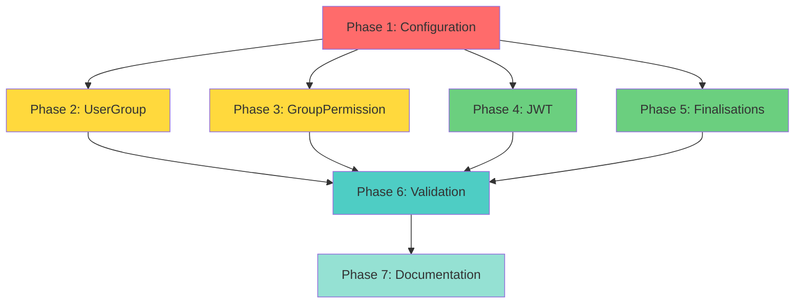

# Implementation Plan: Test Fixes and System Validation

## Overview

Ce plan d'implémentation détaille les étapes pour corriger les 13 tests échoués dans le système de gestion des utilisateurs. L'approche est incrémentale et priorise les corrections qui débloquent le plus de tests.

## Tasks

### Phase 1: Configuration et Infrastructure (4 tests)

- [ ] 1. Corriger la configuration Redis pour les tests
  - [ ] 1.1 Modifier rhBack/settings.py pour détecter pytest correctement
    - Améliorer la détection du mode test
    - Utiliser DummyCache au lieu de Redis pour les tests
    - Configurer SESSION_ENGINE pour utiliser la DB au lieu de Redis
    - _Validates: Requirement 3_

  - [ ] 1.2 Vérifier que la configuration s'applique correctement
    - Exécuter les tests property-based
    - Vérifier qu'aucune erreur CLIENT_CLASS n'apparaît
    - Confirmer que DummyCache est utilisé
    - _Validates: Requirement 3_

  - [ ] 1.3 Tester les 4 tests property-based
    - `test_all_predefined_groups_exist_and_have_permissions`
    - `test_permission_action_distribution_is_appropriate`
    - `test_predefined_group_has_appropriate_default_permissions`
    - `test_resource_permissions_are_consistently_assigned`
    - _Validates: Requirement 3, 7_

### Phase 2: Serializers UserGroup (3 tests)

- [ ] 2. Créer et configurer UserGroupSerializer
  - [ ] 2.1 Créer UserGroupWriteSerializer
    - Ajouter validation pour user_id not null
    - Ajouter validation pour group_id not null
    - Ajouter validation pour user exists
    - Ajouter validation pour group exists
    - Ajouter validation pour duplicate assignment
    - _Validates: Requirement 1_

  - [ ] 2.2 Créer UserGroupReadSerializer
    - Ajouter champs expanded (user_email, user_name, etc.)
    - Utiliser FlexFieldsModelSerializer
    - Ajouter méthodes pour computed fields
    - _Validates: Requirement 1_

  - [ ] 2.3 Mettre à jour UserGroupViewSet
    - Implémenter get_serializer_class()
    - Utiliser WriteSerializer pour create/update
    - Utiliser ReadSerializer pour list/retrieve
    - _Validates: Requirement 1_

  - [ ] 2.4 Tester les 3 tests d'assignation UserGroup
    - `test_user_group_assignment_workflow`
    - `test_user_group_assignment_failure_scenarios`
    - `test_audit_logging_integration`
    - _Validates: Requirement 1, 7_

### Phase 3: Serializers GroupPermission (2 tests)

- [ ] 3. Créer et configurer GroupPermissionSerializer
  - [ ] 3.1 Créer GroupPermissionWriteSerializer
    - Implémenter validation pour duplicate permission
    - Ajouter méthode asave() pour async operations
    - Valider que group et permission existent
    - _Validates: Requirement 2_

  - [ ] 3.2 Créer GroupPermissionReadSerializer
    - Ajouter champs expanded (group_name, permission_name, etc.)
    - Utiliser FlexFieldsModelSerializer
    - Ajouter méthodes pour computed fields
    - _Validates: Requirement 2_

  - [ ] 3.3 Mettre à jour GroupPermissionViewSet
    - Implémenter get_serializer_class()
    - Utiliser WriteSerializer pour create/update
    - Utiliser ReadSerializer pour list/retrieve
    - _Validates: Requirement 2_

  - [ ] 3.4 Tester les 2 tests de gestion des permissions
    - `test_permission_management_workflow`
    - `test_permission_management_failure_scenarios`
    - _Validates: Requirement 2, 7_

### Phase 4: Réponses JWT (2 tests)

- [ ] 4. Standardiser les noms de champs JWT
  - [ ] 4.1 Modifier LoginView
    - Changer 'access_token' en 'access'
    - Changer 'refresh_token' en 'refresh'
    - Vérifier la cohérence avec DRF Simple JWT
    - _Validates: Requirement 4_

  - [ ] 4.2 Modifier RefreshTokenView
    - Changer 'access_token' en
les codes HTTP et variables manquantes
  - [ ] 5.1 Analyser test_unauthorized_access_scenarios
    - Identifier si le comportement actuel (403) est correct
    - Ou si le test doit être modifié pour attendre 403
    - Documenter la décision
    - _Validates: Requirement 5_

  - [ ] 5.2 Corriger le test ou le code
    - Si le code est correct: modifier le test pour attendre 403
    - Si le test est correct: modifier le code pour retourner 401
    - Ajouter des commentaires expliquant 401 vs 403
    - _Validates: Requirement 5_

  - [ ] 5.3 Corriger test_user_group_removal_workflow
    - Ajouter la définition de user_groups_url
    - Vérifier que toutes les variables sont définies
    - Tester le workflow complet
    - _Validates: Requirement 6_

  - [ ] 5.4 Tester les 2 tests corrigés
    - `test_unauthorized_access_scenarios`
    - `test_user_group_removal_workflow`
    - _Validates: Requirement 5, 6, 7_

### Phase 6: Validation Complète (Tous les tests)

- [ ] 6. Exécuter la suite complète de tests
  - [ ] 6.1 Exécuter tous les tests avec pytest
    - Commande: `python -m pytest user_app/tests/ -v`
    - Vérifier que 34/34 tests passent
    - Noter le temps d'exécution
    - _Validates: Requirement 7_

  - [ ] 6.2 Vérifier la couverture de code
    - Exécuter avec coverage: `python -m pytest user_app/tests/ --cov=user_app --cov-report=html`
    - Vérifier que la couverture est > 90%
    - Identifier les zones non couvertes
    - _Validates: Requirement 7_

  - [ ] 6.3 Vérifier qu'il n'y a pas de régression
    - Comparer avec les résultats précédents
    - S'assurer que les 22 tests précédemment passants passent toujours
    - Documenter tout changement de comportement
    - _Validates: Requirement 7_

### Phase 7: Documentation (Finalisation)

- [ ] 7. Documenter les corrections
  - [ ] 7.1 Créer un document de résumé des corrections
    - Lister chaque problème avec sa solution
    - Inclure des exemples de code avant/après
    - Expliquer les causes racines
    - _Validates: Requirement 8_

  - [ ] 7.2 Mettre à jour la documentation API
    - Corriger les exemples dans DRF Spectacular
    - Mettre à jour les docstrings des vues
    - Ajouter des notes sur les validations
    - _Validates: Requirement 8_

  - [ ] 7.3 Créer un guide de bonnes pratiques
    - Documenter quand utiliser read vs write serializers
    - Expliquer 401 vs 403
    - Documenter les validations requises
    - Ajouter des exemples de code
    - _Validates: Requirement 8_

  - [ ] 7.4 Mettre à jour PROGRES_TESTS.md
    - Documenter les 13 corrections effectuées
    - Mettre à jour les statistiques (34/34 = 100%)
    - Ajouter les leçons apprises
    - _Validates: Requirement 8_

## Checkpoints

### Checkpoint 1: Configuration (Après Phase 1)
- [ ] PostgreSQL est utilisé pour les tests (pas SQLite)
- [ ] Redis est utilisé pour les tests (pas DummyCache)
- [ ] Les VRAIES erreurs sont visibles et documentées
- [ ] La base de test PostgreSQL est créée et migrée
- **Critère de succès**: Voir les erreurs réelles pour pouvoir les corriger

### Checkpoint 2: Serializers (Après Phases 2-3)
- [ ] Les 5 tests de serializers passent (3 UserGroup + 2 GroupPermission)
- [ ] Les validations fonctionnent correctement
- [ ] Aucune erreur de contrainte NOT NULL
- [ ] Aucune erreur AttributeError sur asave()
- **Critère de succès**: 31/34 tests passent (26 + 5 nouveaux)

### Checkpoint 3: JWT et Finalisations (Après Phases 4-5)
- [ ] Les 4 tests restants passent (2 JWT + 2 autres)
- [ ] Les noms de champs JWT sont cohérents
- [ ] Les codes HTTP sont corrects
- [ ] Toutes les variables sont définies
- **Critère de succès**: 34/34 tests passent (100%)

### Checkpoint 4: Validation Finale (Après Phase 6)
- [ ] Tous les tests passent (34/34)
- [ ] Couverture de code > 90%
- [ ] Temps d'exécution < 5 minutes
- [ ] Aucune régression
- **Critère de succès**: Système validé et prêt pour production

### Checkpoint 5: Documentation (Après Phase 7)
- [ ] Documentation complète et à jour
- [ ] Guide de bonnes pratiques créé
- [ ] Exemples de code fournis
- [ ] Leçons apprises documentées
- **Critère de succès**: Documentation complète et accessible

## Ordre d'Exécution Recommandé

1. **Phase 1 (Configuration)** - Débloque 4 tests property-based
2. **Phase 2 (UserGroup)** - Débloque 3 tests d'assignation
3. **Phase 3 (GroupPermission)** - Débloque 2 tests de permissions
4. **Phase 4 (JWT)** - Débloque 2 tests d'intégration
5. **Phase 5 (Finalisations)** - Débloque 2 tests restants
6. **Phase 6 (Validation)** - Confirme que tout fonctionne
7. **Phase 7 (Documentation)** - Finalise le travail

## Estimation du Temps

| Phase | Tâches | Temps Estimé | Tests Débloqués |
|-------|--------|--------------|-----------------|
| Phase 1 | Configuration Redis | 30 minutes | 4 tests |
| Phase 2 | UserGroup Serializers | 1 heure | 3 tests |
| Phase 3 | GroupPermission Serializers | 45 minutes | 2 tests |
| Phase 4 | JWT Response Fields | 30 minutes | 2 tests |
| Phase 5 | HTTP Codes & Variables | 30 minutes | 2 tests |
| Phase 6 | Validation Complète | 30 minutes | Validation |
| Phase 7 | Documentation | 45 minutes | Finalisation |
| **Total** | **7 phases** | **4h 30min** | **13 tests** |

## Dépendances entre Tâches



## Notes Importantes

- **Priorité 1**: Phase 1 (Configuration) - Débloque le plus de tests
- **Priorité 2**: Phases 2-3 (Serializers) - Corrige les problèmes critiques
- **Priorité 3**: Phases 4-5 (Finalisations) - Corrige les problèmes mineurs
- **Validation**: Phase 6 - Confirme que tout fonctionne
- **Documentation**: Phase 7 - Finalise et documente

- Chaque phase doit être testée avant de passer à la suivante
- Les checkpoints permettent de valider la progression
- La documentation doit être mise à jour au fur et à mesure
- Les tests doivent être exécutés fréquemment pour détecter les régressions

## Commandes Utiles

```bash
# Exécuter tous les tests
python -m pytest user_app/tests/ -v

# Exécuter un test spécifique
python -m pytest user_app/tests/test_user_management_e2e.py::UserManagementE2ETestCase::test_user_group_assignment_workflow -v

# Exécuter avec couverture
python -m pytest user_app/tests/ --cov=user_app --cov-report=html

# Exécuter les tests property-based uniquement
python -m pytest user_app/tests/test_default_group_permissions_property.py -v

# Vérifier les diagnostics
# (Utiliser getDiagnostics tool dans Kiro)
```

## Critères de Succès Globaux

- ✅ 34/34 tests passent (100%)
- ✅ Couverture de code > 90%
- ✅ Temps d'exécution < 5 minutes
- ✅ Aucune régression
- ✅ Documentation complète
- ✅ Code propre et bien structuré
- ✅ Validations explicites et claires
- ✅ Messages d'erreur descriptifs
