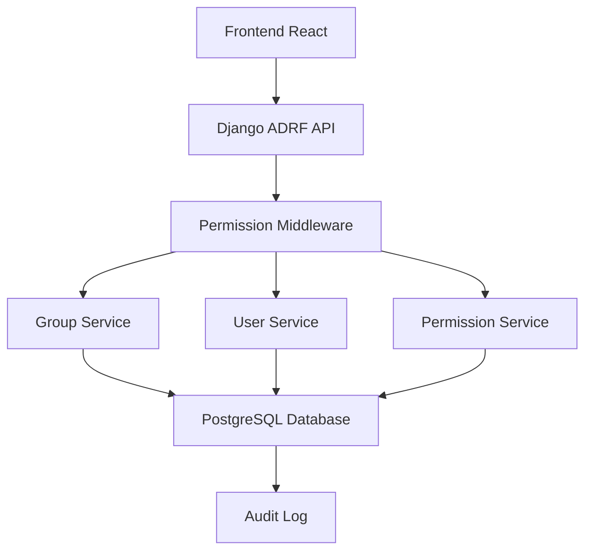
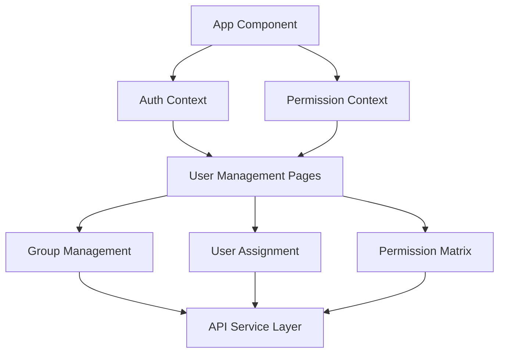
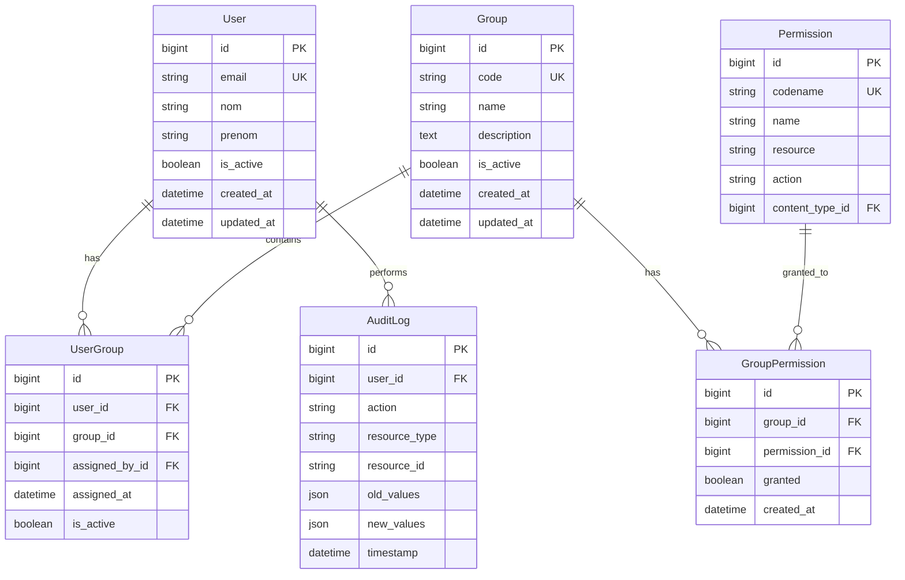

# Design Document

## Overview

Ce document présente la conception d'un système de gestion des utilisateurs avec contrôle d'accès basé sur les rôles (RBAC) pour l'application RH. Le système permettra d'assigner des utilisateurs à des groupes prédéfinis et de contrôler l'accès aux fonctionnalités selon leurs permissions.

L'architecture suit une approche moderne avec un backend Django utilisant ADRF (Async Django REST Framework) et un frontend React TypeScript avec une gestion d'état centralisée et des composants réutilisables pour le contrôle d'accès.

## Architecture

### Backend Architecture

Le backend utilise une architecture en couches avec les composants suivants :



**Couches principales :**
- **API Layer** : Endpoints ADRF avec sérialisation flexible
- **Service Layer** : Logique métier pour la gestion des groupes et permissions
- **Data Layer** : Modèles Django avec relations optimisées
- **Middleware Layer** : Vérification des permissions et audit

### Frontend Architecture

Le frontend suit une architecture basée sur des composants avec gestion d'état centralisée :



## Components and Interfaces

### Backend Components

#### 1. Models

**Group Model**
```python
class Group(models.Model):
    code = models.CharField(max_length=10, unique=True)
    name = models.CharField(max
signed_at = models.DateTimeField(auto_now_add=True)
    is_active = models.BooleanField(default=True)
```

**Permission Model**
```python
class Permission(models.Model):
    codename = models.CharField(max_length=100, unique=True)
    name = models.CharField(max_length=255)
    content_type = models.ForeignKey(ContentType, on_delete=models.CASCADE)
    resource = models.CharField(max_length=100)
    action = models.CharField(max_length=50)  # CREATE, READ, UPDATE, DELETE
```

**GroupPermission Model**
```python
class GroupPermission(models.Model):
    group = models.ForeignKey(Group, on_delete=models.CASCADE)
    permission = models.ForeignKey(Permission, on_delete=models.CASCADE)
    granted = models.BooleanField(default=True)
    created_at = models.DateTimeField(auto_now_add=True)
```

#### 2. API Views (ADRF)

**GroupViewSet**
```python
class GroupViewSet(AsyncModelViewSet):
    queryset = Group.objects.all()
    serializer_class = GroupSerializer
    permission_classes = [IsAuthenticated, HasGroupPermission]
    filter_backends = [FlexFieldsFilterBackend, SearchFilter, OrderingFilter]
    search_fields = ['name', 'code', 'description']
    ordering_fields = ['name', 'code', 'created_at']
```

**UserGroupViewSet**
```python
class UserGroupViewSet(AsyncModelViewSet):
    serializer_class = UserGroupSerializer
    permission_classes = [IsAuthenticated, CanManageUserGroups]

    async def get_queryset(self):
        return UserGroup.objects.select_related('user', 'group')
```

#### 3. Permission System

**Custom Permission Classes**
```python
class HasGroupPermission(BasePermission):
    async def has_permission(self, request, view):
        user_permissions = await get_user_permissions(request.user)
        required_permission = f"{view.action}_{view.get_queryset().model._meta.model_name}"
        return required_permission in user_permissions
```

**Permission Service**
```python
class PermissionService:
    @staticmethod
    async def get_user_permissions(user):
        # Récupère toutes les permissions de l'utilisateur via ses groupes

    @staticmethod
    async def check_permission(user, resource, action):
        # Vérifie si l'utilisateur a une permission spécifique

    @staticmethod
    async def get_effective_permissions(user):
        # Retourne l'ensemble des permissions effectives
```

### Frontend Components

#### 1. Context Providers

**AuthContext**
```typescript
interface AuthContextType {
  user: User | null;
  permissions: Permission[];
  groups: Group[];
  login: (credentials: LoginCredentials) => Promise<void>;
  logout: () => void;
  hasPermission: (resource: string, action: string) => boolean;
  hasAnyGroup: (groupCodes: string[]) => boolean;
}
```

**PermissionContext**
```typescript
interface PermissionContextType {
  permissions: Permission[];
  groups: Group[];
  refreshPermissions: () => Promise<void>;
  checkPermission: (resource: string, action: string) => boolean;
}
```

#### 2. Core Components

**ProtectedRoute Component**
```typescript
interface ProtectedRouteProps {
  children: React.ReactNode;
  requiredPermission?: string;
  requiredGroups?: string[];
  fallback?: React.ReactNode;
}
```

**PermissionGate Component**
```typescript
interface PermissionGateProps {
  resource: string;
  action: string;
  groups?: string[];
  children: React.ReactNode;
  fallback?: React.ReactNode;
}
```

**UserGroupManager Component**
```typescript
interface UserGroupManagerProps {
  userId: string;
  onAssignmentChange?: (assignments: UserGroup[]) => void;
}
```

#### 3. Hooks

**usePermissions Hook**
```typescript
interface UsePermissionsReturn {
  hasPermission: (resource: string, action: string) => boolean;
  hasAnyGroup: (groupCodes: string[]) => boolean;
  permissions: Permission[];
  groups: Group[];
  loading: boolean;
}
```

**useUserGroups Hook**
```typescript
interface UseUserGroupsReturn {
  userGroups: UserGroup[];
  assignGroup: (userId: string, groupId: string) => Promise<void>;
  removeGroup: (userId: string, groupId: string) => Promise<void>;
  loading: boolean;
  error: string | null;
}
```

## Data Models

### Database Schema



### API Data Structures

**Group Response**
```typescript
interface Group {
  id: number;
  code: string;
  name: string;
  description: string;
  is_active: boolean;
  user_count?: number;
  permission_count?: number;
  created_at: string;
  updated_at: string;
}
```

**User with Groups Response**
```typescript
interface UserWithGroups {
  id: number;
  email: string;
  nom: string;
  prenom: string;
  is_active: boolean;
  groups: Group[];
  effective_permissions: Permission[];
  last_login: string | null;
}
```

**Permission Response**
```typescript
interface Permission {
  id: number;
  codename: string;
  name: string;
  resource: string;
  action: string;
  content_type: string;
}
```

## Correctness Properties

*A property is a characteristic or behavior that should hold true across all valid executions of a system-essentially, a formal statement about what the system should do. Properties serve as the bridge between human-readable specifications and machine-verifiable correctness guarantees.*

### Property 1: Group Data Integrity
*For any* API request to retrieve groups, the response should contain all 21 predefined groups (ADM, AP, AI, CSE, CH, CS, CSFP, CCI, CM, DIR, GS, IT, JR, LG, PL, PCA, PCR, PCDR, RAF, RRH, SEC) with their correct codes and descriptions, and support pagination parameters.
**Validates: Requirements 1.1, 1.2, 1.3**

### Property 2: User-Group Assignment Validation
*For any* user-group assignment operation, the system should validate that the group exists, allow multiple group assignments per user, and immediately update the user's effective permissions.
**Validates: Requirements 2.1, 2.2, 2.3, 2.4**

### Property 3: Permission-Based Access Control
*For any* API endpoint access attempt, the system should verify user permissions based on their assigned groups, return HTTP 403 for unauthorized access with descriptive messages, and properly enforce hierarchical permissions.
**Validates: Requirements 3.1, 3.2, 3.3, 3.4, 3.6**

### Property 4: CRUD Permission Granularity
*For any* resource and user combination, the system should properly enforce Create, Read, Update, Delete permissions at both resource and action levels, with immediate propagation of permission changes to all affected users.
**Validates: Requirements 4.1, 4.3, 4.6**

### Property 5: API Consistency and Standards
*For any* user management API endpoint, it should use ADRF patterns, support flexible field selection via query parameters, provide consistent error responses, and include proper filtering, searching, and ordering capabilities.
**Validates: Requirements 5.1, 5.2, 5.3, 5.4, 5.6**

### Property 6: Frontend UI Data Display
*For any* user interface component, it should correctly display user groups and permissions with proper TypeScript typing, responsive design, visual permission indicators, and comprehensive error handling.
**Validates: Requirements 6.1, 6.2, 6.4, 6.5, 6.6**

### Property 7: Comprehensive Audit Logging
*For any* user-group assignment or permission modification, the system should create audit log entries with timestamps, user details, old and new values, and integrate with the existing audit_log model.
**Validates: Requirements 7.1, 7.2, 7.4**

### Property 8: Assignment Interface Functionality
*For any* user-group assignment operation through the frontend interface, it should provide intuitive drag-and-drop or selection functionality and display all current group assignments for each user.
**Validates: Requirements 2.5, 2.6**

### Property 9: Default Group Permissions
*For any* predefined group, the system should include appropriate default permission sets that align with the group's organizational role and responsibilities.
**Validates: Requirements 4.4**

### Property 10: Permission Management Interface
*For any* group permission modification through the frontend, the interface should allow viewing and modifying permissions with proper grouping by functionality or module.
**Validates: Requirements 4.2, 4.5, 6.3**

## Error Handling

### Backend Error Handling

**Authentication Errors**
- Invalid JWT tokens return HTTP 401 with clear error messages
- Expired tokens trigger automatic refresh or redirect to login
- Missing authentication returns HTTP 401 with authentication required message

**Authorization Errors**
- Insufficient permissions return HTTP 403 with specific permission requirements
- Invalid group assignments return HTTP 400 with validation details
- Resource not found returns HTTP 404 with resource identification

**Validation Errors**
- Invalid input data returns HTTP 400 with field-specific error messages
- Duplicate group assignments return HTTP 409 with conflict details
- Database constraint violations return HTTP 422 with constraint information

**System Errors**
- Database connection errors return HTTP 503 with retry information
- Internal server errors return HTTP 500 with error tracking ID
- Rate limiting returns HTTP 429 with retry-after headers

### Frontend Error Handling

**Network Errors**
- Connection timeouts show retry options with exponential backoff
- Network unavailable displays offline mode with cached data
- Server errors show user-friendly messages with support contact

**Validation Errors**
- Form validation errors highlight specific fields with clear messages
- Real-time validation provides immediate feedback
- Bulk operation errors show detailed results with success/failure counts

**Permission Errors**
- Unauthorized access redirects to appropriate page with explanation
- Insufficient permissions show upgrade/contact administrator options
- Session expiry triggers automatic re-authentication flow

**User Experience Errors**
- Loading states prevent multiple submissions
- Optimistic updates with rollback on failure
- Toast notifications for success/error feedback

## Testing Strategy

### Backend Testing Approach

**Unit Testing with Django Test Framework**
- Test all API endpoints with various input combinations
- Mock external dependencies and focus on business logic
- Test permission validation logic with edge cases
- Verify audit logging functionality with different scenarios

**Property-Based Testing**
- Generate random user-group combinations to test permission inheritance
- Test API pagination with various page sizes and offsets
- Validate permission checking across all resource-action combinations
- Test group assignment validation with invalid and valid inputs

**Integration Testing**
- Test complete user-group-permission workflows end-to-end
- Verify database transactions and rollback scenarios
- Test middleware integration with authentication and authorization
- Validate audit log integration with existing systems

### Frontend Testing Approach

**Component Testing with Vitest**
- Test all user management components in isolation
- Mock API calls and test component behavior with different data states
- Test permission-based UI rendering with various user roles
- Verify form validation and error handling scenarios

**Integration Testing**
- Test component interactions and data flow
- Verify context providers and state management
- Test routing and navigation with different permission levels
- Validate API integration and error handling

**End-to-End Testing**
- Test critical user management workflows from login to permission assignment
- Verify responsive design across different screen sizes
- Test accessibility features and keyboard navigation
- Validate error scenarios and recovery flows

### Testing Configuration

**Property-Based Test Settings**
- Minimum 100 iterations per property test for thorough coverage
- Custom generators for user, group, and permission data
- Shrinking strategies to find minimal failing examples
- Seed-based reproducible test runs for debugging

**Test Data Management**
- Factory classes for creating test users, groups, and permissions
- Database fixtures for consistent test environments
- Cleanup strategies to prevent test interference
- Performance testing with large datasets

**Continuous Integration**
- Automated test execution on all pull requests
- Code coverage reporting with minimum 90% threshold
- Performance regression testing for API endpoints
- Security testing for authentication and authorization flows
