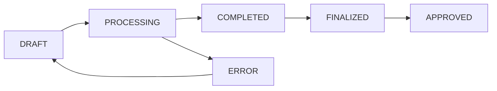

# Gestion des Périodes de Paie

Les périodes de paie sont le cœur du système. Elles organisent le traitement mensuel des salaires et suivent un cycle de vie strict pour assurer la cohérence et la traçabilité.

## Cycle de Vie d'une Période



### Statuts des Périodes

| Statut | Description | Actions Possibles |
|--------|-------------|-------------------|
| **DRAFT** | Période créée, prête pour traitement | Traiter, Modifier, Supprimer |
| **PROCESSING** | Trait
    "description": "Paie Mars 2024"
}
```

**Réponse :**
```json
{
    "id": 15,
    "annee": 2024,
    "mois": 3,
    "date_debut": "2024-03-01",
    "date_fin": "2024-03-31",
    "statut": "DRAFT",
    "description": "Paie Mars 2024",
    "nombre_employes": 0,
    "masse_salariale": "0.00",
    "total_cotisations_patronales": "0.00",
    "total_cotisations_salariales": "0.00",
    "cree_le": "2024-03-01T08:00:00Z",
    "cree_par": {
        "id": 1,
        "username": "admin",
        "nom_complet": "Administrateur Système"
    }
}
```

### Validation Automatique

Le système effectue automatiquement ces vérifications :

- ✅ **Unicité** : Une seule période par mois/année
- ✅ **Dates** : Calcul automatique des dates de début/fin
- ✅ **Permissions** : Vérification des droits utilisateur
- ✅ **Cohérence** : Validation des données d'entrée

### Règles de Création

1. **Période Unique** : Impossible de créer deux périodes pour le même mois/année
2. **Ordre Chronologique** : Recommandé de traiter les périodes dans l'ordre
3. **Permissions** : Seuls les utilisateurs avec rôle RH peuvent créer des périodes

## Traitement d'une Période

### Lancement du Traitement

```http
POST /api/paie/periodes/{id}/process/
Authorization: Bearer YOUR_TOKEN

{
    "force_reprocess": false,
    "include_suspended": false,
    "batch_size": 50
}
```

### Paramètres de Traitement

| Paramètre | Type | Description | Défaut |
|-----------|------|-------------|--------|
| `force_reprocess` | boolean | Retraiter même si déjà traité | `false` |
| `include_suspended` | boolean | Inclure employés suspendus | `false` |
| `batch_size` | integer | Taille des lots de traitement | `50` |
| `async_processing` | boolean | Traitement asynchrone | `true` |

### Processus de Traitement

1. **Validation Préalable**
   - Vérification des contrats actifs
   - Validation des paramètres de paie
   - Contrôle des retenues actives

2. **Traitement par Lots**
   - Récupération des employés éligibles
   - Calcul des salaires par lots
   - Application des retenues
   - Génération des entrées de paie

3. **Calculs Automatiques**
   - Salaire brut (base + indemnités + allocations)
   - Cotisations patronales et salariales
   - Base imposable et IRE
   - Retenues diverses
   - Salaire net

4. **Validation Post-Traitement**
   - Vérification de la cohérence des calculs
   - Contrôle des plafonds réglementaires
   - Génération d'alertes si nécessaire

### Suivi du Traitement

```http
GET /api/paie/periodes/{id}/processing-status/
```

**Réponse :**
```json
{
    "status": "PROCESSING",
    "progress": 75,
    "employes_traites": 38,
    "employes_total": 50,
    "temps_ecoule": "00:02:15",
    "temps_estime": "00:03:00",
    "erreurs": [],
    "derniere_mise_a_jour": "2024-03-01T08:15:30Z"
}
```

## Gestion des Erreurs

### Types d'Erreurs Courantes

1. **Contrat Manquant**
   ```json
   {
       "type": "MISSING_CONTRACT",
       "employe_id": 123,
       "message": "Aucun contrat actif pour la période",
       "resolution": "Créer ou activer un contrat pour cet employé"
   }
   ```

2. **Données Contractuelles Invalides**
   ```json
   {
       "type": "INVALID_CONTRACT_DATA",
       "employe_id": 124,
       "message": "Salaire de base manquant",
       "resolution": "Compléter les informations contractuelles"
   }
   ```

3. **Erreur de Calcul**
   ```json
   {
       "type": "CALCULATION_ERROR",
       "employe_id": 125,
       "message": "Dépassement du plafond INSS",
       "resolution": "Vérifier les paramètres de cotisation"
   }
   ```

### Résolution des Erreurs

```http
POST /api/paie/periodes/{id}/resolve-errors/
Content-Type: application/json

{
    "actions": [
        {
            "error_id": "ERR001",
            "action": "skip_employee",
            "employe_id": 123
        },
        {
            "error_id": "ERR002",
            "action": "fix_and_retry",
            "employe_id": 124,
            "corrections": {
                "salaire_base": 500000
            }
        }
    ]
}
```

## Retraitement d'une Période

### Cas de Retraitement

- **Correction de données** : Modification des contrats ou retenues
- **Mise à jour des paramètres** : Changement des barèmes ou taux
- **Ajout d'employés** : Nouveaux contrats activés
- **Correction d'erreurs** : Résolution de problèmes de calcul

### Lancement du Retraitement

```http
POST /api/paie/periodes/{id}/reprocess/
Content-Type: application/json

{
    "clear_existing": true,
    "reason": "Correction des taux de cotisation INSS",
    "affected_employees": [123, 124, 125]
}
```

### Précautions

⚠️ **Attention** : Le retraitement écrase les calculs existants
- Sauvegardez les données importantes avant retraitement
- Informez les utilisateurs du retraitement en cours
- Vérifiez les bulletins déjà générés

## Finalisation et Approbation

### Finalisation

La finalisation verrouille les calculs et empêche les modifications :

```http
POST /api/paie/periodes/{id}/finalize/
Content-Type: application/json

{
    "confirmation": true,
    "notes": "Validation terminée, prêt pour approbation"
}
```

**Effets de la finalisation :**
- ✅ Calculs verrouillés
- ✅ Génération des totaux définitifs
- ✅ Préparation pour approbation
- ❌ Plus de modification possible

### Approbation

L'approbation est l'étape finale qui valide officiellement la période :

```http
POST /api/paie/periodes/{id}/approve/
Content-Type: application/json

{
    "approved_by": "Directeur RH",
    "approval_notes": "Période validée et approuvée pour paiement",
    "approval_date": "2024-03-05"
}
```

## Consultation et Filtrage

### Liste des Périodes

```http
GET /api/paie/periodes/?annee=2024&statut=COMPLETED&ordering=-date_creation
```

**Filtres disponibles :**
- `annee` : Année de la période
- `mois` : Mois de la période
- `statut` : Statut de la période
- `traite_par` : Utilisateur ayant traité
- `date_creation` : Date de création
- `masse_salariale_min/max` : Fourchette de masse salariale

### Détail d'une Période

```http
GET /api/paie/periodes/{id}/?expand=entries,traite_par,approuve_par
```

**Réponse détaillée :**
```json
{
    "id": 15,
    "annee": 2024,
    "mois": 3,
    "statut": "APPROVED",
    "statistiques": {
        "nombre_employes": 50,
        "masse_salariale": "25000000.00",
        "total_cotisations_patronales": "3750000.00",
        "total_cotisations_salariales": "2500000.00",
        "total_ire": "1200000.00",
        "total_retenues": "800000.00"
    },
    "entries": [...],
    "traite_par": {...},
    "approuve_par": {...},
    "historique": [...]
}
```

## Bonnes Pratiques

### Planification

1. **Calendrier Mensuel** : Créez les périodes à l'avance
2. **Validation Progressive** : Vérifiez les données avant traitement
3. **Sauvegarde** : Exportez les données avant modifications importantes

### Traitement

1. **Heures Creuses** : Lancez les traitements en dehors des heures de pointe
2. **Surveillance** : Surveillez le processus de traitement
3. **Validation** : Vérifiez systématiquement les résultats

### Sécurité

1. **Permissions** : Limitez l'accès aux utilisateurs autorisés
2. **Audit** : Conservez les traces de toutes les opérations
3. **Approbation** : Implémentez un processus d'approbation à deux niveaux

## Automatisation

### Création Automatique

```python
# Script de création automatique des périodes
from datetime import datetime, timedelta
from paie_app.services.period_processor import PeriodProcessorService

def create_next_period():
    today = datetime.now()
    next_month = today.replace(day=1) + timedelta(days=32)
    next_month = next_month.replace(day=1)

    service = PeriodProcessorService()
    period = service.create_period(
        annee=next_month.year,
        mois=next_month.month,
        user_id=1  # Utilisateur système
    )

    return period
```

### Notifications

Configurez des notifications pour :
- Période créée
- Traitement terminé
- Erreurs détectées
- Approbation requise

---

*Pour plus d'informations sur les calculs salariaux, consultez le [Guide des Calculs Salariaux](salary-calculations.md).*
