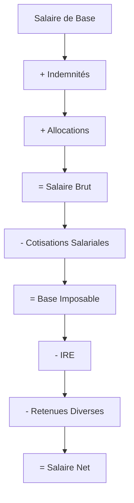

# Calculs Salariaux

Ce guide détaille tous les aspects des calculs salariaux automatisés du système, incluant les composants du salaire, les cotisations, les taxes et les retenues.

## Vue d'Ensemble du Calcul

Le calcul salarial suit cette séquence :



## Composants du Salaire Brut

### 1. Salaire de Base

Le salaire de base provient du contrat actif de l'employé :

```json
{
    "salaire_base": 800000.00,
    "source": "contrat.salaire_base",
    "devise": "USD",
    "periode": "mensuel"
}
```

**Règles :**
- Utilise le contrat actif à la date de traitement
- Montant fixe défini dans le contrat
- Exprimé en USD (devise de référence)

### 2. Indemnités Contractuelles

Les indemnités sont calculées en pourcentage du salaire de base :

#### Indemnité de Logement
```python
indemnite_logement = salaire_base * (pourcentage_logement / 100)
```

#### Indemnité de Déplacement
```python
indemnite_deplacement = salaire_base * (pourcentage_deplacement / 100)
```

#### Indemnité de Fonction
```python
indemnite_fonction = salaire_base * (pourcentage_fonction / 100)
```

**Exemple de calcul :**
```json
{
    "salaire_base": 800000.00,
    "indemnites": {
        "logement": {
            "pourcentage": 15,
            "montant": 120000.00
        },
        "deplacement": {
            "pourcentage": 5,
            "montant": 40000.00
        },
        "fonction": {
            "pourcentage": 15,
            "montant": 120000.00
        }
    },
    "total_indemnites": 280000.00
}
```

### 3. Allocation Familiale

L'allocation familiale suit un barème progressif basé sur le nombre d'enfants :

| Nombre d'Enfants | Montant (USD) |
|------------------|---------------|
| 0 | 0 |
| 1 | 15,000 |
| 2 | 35,000 |
| 3 | 60,000 |
| 4 | 90,000 |
| 5+ | 125,000 |

**Calcul :**
```python
def calculate_family_allowance(nombre_enfants):
    baremes = {
        0: 0,
        1: 15000,
        2: 35000,
        3: 60000,
        4: 90000,
        5: 125000
    }

    if nombre_enfants >= 5:
        return baremes[5]
    return baremes.get(nombre_enfants, 0)
```

### 4. Autres Avantages

Avantages supplémentaires définis au niveau du contrat :
- Prime de performance
- Avantages en nature
- Primes exceptionnelles

## Cotisations Sociales

### Cotisations Patronales

Les cotisations patronales sont à la charge de l'employeur :

| Type | Taux | Base de Calcul | Plafond |
|------|------|----------------|---------|
| **INSS Pension** | 6% | Salaire brut | 27,000 USD |
| **INSS Risque** | 6% | Salaire brut | 2,400 USD |
| **MFP** | 1.5% | Salaire brut | Aucun |
| **FPC** | 0.5% | Salaire brut | Aucun |

**Calcul INSS avec plafonds :**
```python
def calculate_inss_pension_patronal(salaire_brut):
    base_calcul = min(salaire_brut, 27000)  # Plafond
    return base_calcul * 0.06

def calculate_inss_risque_patronal(salaire_brut):
    base_calcul = min(salaire_brut, 2400)   # Plafond
    return base_calcul * 0.06
```

### Cotisations Salariales

Les cotisations salariales sont déduites du salaire de l'employé :

| Type | Taux | Base de Calcul | Plafond |
|------|------|----------------|---------|
| **INSS Pension** | 3% | Salaire brut | 27,000 USD |
| **INSS Risque** | 1.5% | Salaire brut | 2,400 USD |
| **MFP** | 1% | Salaire brut | Aucun |

**Exemple de calcul complet :**
```json
{
    "salaire_brut": 1080000.00,
    "cotisations_patronales": {
        "inss_pension": 27000.00,  // min(1080000, 27000) * 6%
        "inss_risque": 2400.00,    // min(1080000, 2400) * 6%
        "mfp": 16200.00,           // 1080000 * 1.5%
        "fpc": 5400.00,            // 1080000 * 0.5%
        "total": 51000.00
    },
    "cotisations_salariales": {
        "inss_pension": 13500.00,  // min(1080000, 27000) * 3%
        "inss_risque": 1200.00,    // min(1080000, 2400) * 1.5%
        "mfp": 10800.00,           // 1080000 * 1%
        "total": 25500.00
    }
}
```

## Calcul de l'IRE (Impôt sur les Revenus)

L'IRE suit un barème progressif appliqué à la base imposable :

### Base Imposable
```python
base_imposable = salaire_brut - cotisations_salariales
```

### Barème IRE

| Tranche | Taux | Calcul |
|---------|------|--------|
| 0 - 150,000 USD | 0% | Exonéré |
| 150,001 - 300,000 USD | 20% | (montant - 150,000) × 20% |
| 300,001 USD et plus | 30% | 30,000 + (montant - 300,000) × 30% |

**Calcul progressif :**
```python
def calculate_ire(base_imposable):
    if base_imposable <= 150000:
        return 0
    elif base_imposable <= 300000:
        return (base_imposable - 150000) * 0.20
    else:
        return 30000 + (base_imposable - 300000) * 0.30
```

**Exemple :**
```json
{
    "base_imposable": 1054500.00,
    "calcul_ire": {
        "tranche_1": {
            "montant": 150000.00,
            "taux": 0,
            "ire": 0
        },
        "tranche_2": {
            "montant": 150000.00,
            "taux": 20,
            "ire": 30000.00
        },
        "tranche_3": {
            "montant": 754500.00,
            "taux": 30,
            "ire": 226350.00
        },
        "total_ire": 256350.00
    }
}
```

## Retenues Diverses

### Types de Retenues

1. **Prêts** (`LOAN`)
   - Remboursement de prêts accordés
   - Montant fixe mensuel
   - Arrêt automatique à échéance

2. **Avances** (`ADVANCE`)
   - Récupération d'avances sur salaire
   - Montant total défini
   - Déduction jusqu'à remboursement complet

3. **Assurances** (`INSURANCE`)
   - Cotisations d'assurance vie/santé
   - Montant récurrent
   - Pas de limite de durée

4. **Syndicat** (`UNION`)
   - Cotisations syndicales
   - Montant fixe mensuel
   - Déduction continue

### Calcul des Retenues

```python
def calculate_deductions(employe_id, periode):
    retenues_actives = get_active_deductions(employe_id, periode)
    total_retenues = 0
    details = []

    for retenue in retenues_actives:
        montant = calculate_deduction_amount(retenue, periode)
        total_retenues += montant
        details.append({
            'type': retenue.type_retenue,
            'description': retenue.description,
            'montant': montant
        })

    return {
        'total': total_retenues,
        'details': details
    }
```

### Gestion des Limites

```python
def calculate_deduction_amount(retenue, periode):
    montant_mensuel = retenue.montant_mensuel

    # Vérifier si montant total défini
    if retenue.montant_total:
        restant = retenue.montant_total - retenue.montant_deja_deduit
        montant_mensuel = min(montant_mensuel, restant)

    # Vérifier les dates de validité
    if not is_deduction_valid_for_period(retenue, periode):
        return 0

    return max(0, montant_mensuel)
```

## Calcul Final du Salaire Net

### Formule Complète

```python
salaire_net = (
    salaire_brut
    - cotisations_salariales
    - ire
    - retenues_diverses
)
```

### Exemple Complet

```json
{
    "employe": {
        "matricule": "EMP003",
        "nom": "TSHIMANGA Pierre",
        "nombre_enfants": 2
    },
    "periode": {
        "annee": 2024,
        "mois": 3
    },
    "calcul": {
        "salaire_base": 800000.00,
        "indemnites": {
            "logement": 120000.00,
            "deplacement": 40000.00,
            "fonction": 120000.00,
            "total": 280000.00
        },
        "allocation_familiale": 35000.00,
        "autres_avantages": 0.00,
        "salaire_brut": 1115000.00,

        "cotisations_salariales": {
            "inss_pension": 13500.00,
            "inss_risque": 1200.00,
            "mfp": 11150.00,
            "total": 25850.00
        },

        "base_imposable": 1089150.00,
        "ire": 236745.00,

        "retenues_diverses": {
            "assurance_vie": 25000.00,
            "total": 25000.00
        },

        "salaire_net": 827405.00
    },
    "cotisations_patronales": {
        "inss_pension": 27000.00,
        "inss_risque": 2400.00,
        "mfp": 16725.00,
        "fpc": 5575.00,
        "total": 51700.00
    },
    "cout_total_employeur": 1166700.00
}
```

## Validation et Contrôles

### Contrôles Automatiques

1. **Cohérence des Montants**
   ```python
   assert salaire_net >= 0, "Le salaire net ne peut être négatif"
   assert salaire_brut > 0, "Le salaire brut doit être positif"
   ```

2. **Respect des Plafonds**
   ```python
   assert inss_pension <= 27000 * 0.03, "Plafond INSS pension dépassé"
   assert inss_risque <= 2400 * 0.015, "Plafond INSS risque dépassé"
   ```

3. **Validation des Pourcentages**
   ```python
   total_indemnites_pct = (
       contrat.pourcentage_logement +
       contrat.pourcentage_deplacement +
       contrat.pourcentage_fonction
   )
   assert total_indemnites_pct <= 100, "Total indemnités > 100%"
   ```

### Alertes Automatiques

Le système génère des alertes pour :
- Salaire net négatif ou très faible
- Dépassement des plafonds réglementaires
- Incohérences dans les calculs
- Retenues dépassant 50% du salaire brut

## Personnalisation des Calculs

### Paramètres Configurables

```json
{
    "cotisations": {
        "inss_pension": {
            "taux_patronal": 6.0,
            "taux_salarial": 3.0,
            "plafond": 27000.00
        },
        "inss_risque": {
            "taux_patronal": 6.0,
            "taux_salarial": 1.5,
            "plafond": 2400.00
        }
    },
    "ire": {
        "tranches": [
            {"min": 0, "max": 150000, "taux": 0},
            {"min": 150001, "max": 300000, "taux": 20},
            {"min": 300001, "max": null, "taux": 30}
        ]
    },
    "allocation_familiale": {
        "baremes": [
            {"enfants": 0, "montant": 0},
            {"enfants": 1, "montant": 15000},
            {"enfants": 2, "montant": 35000}
        ]
    }
}
```

### Formules Personnalisées

Pour des calculs spécifiques, le système permet de définir des formules personnalisées :

```python
# Exemple : Prime de performance basée sur l'évaluation
def calculate_performance_bonus(employe, periode):
    evaluation = get_employee_evaluation(employe, periode)
    base_salary = employe.contrat.salaire_base

    if evaluation >= 90:
        return base_salary * 0.15  # 15% de prime
    elif evaluation >= 80:
        return base_salary * 0.10  # 10% de prime
    elif evaluation >= 70:
        return base_salary * 0.05  # 5% de prime
    else:
        return 0
```

## Historique et Traçabilité

### Sauvegarde des Calculs

Chaque calcul est sauvegardé avec :
- Détail de tous les composants
- Paramètres utilisés (taux, plafonds)
- Date et utilisateur du calcul
- Version des règles appliquées

### Audit des Modifications

```json
{
    "audit_trail": [
        {
            "date": "2024-03-01T10:30:00Z",
            "action": "CALCULATION",
            "user": "admin",
            "details": {
                "salaire_brut": 1115000.00,
                "salaire_net": 827405.00,
                "version_regles": "2024.1"
            }
        },
        {
            "date": "2024-03-02T14:15:00Z",
            "action": "RECALCULATION",
            "user": "rh_manager",
            "reason": "Correction taux INSS",
            "details": {
                "salaire_net_avant": 827405.00,
                "salaire_net_apres": 829205.00
            }
        }
    ]
}
```

---

*Pour plus d'informations sur la gestion des retenues, consultez le [Guide des Retenues](deductions.md).*
